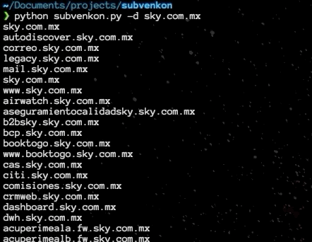

# Subvenkon

Subvenkon is a subdomain enumerator which gathers information from [Venkon](https://www.venkon.us/subdomain-lister/). Venkon mostly is a web interface where the user has to provide the domain and venkon will give the user the results of the subdomains available through its web interface. Subvenkon makes this easier due to its usage straight from the terminal without the need of a browser. Also, I ommited the tool banner when the tool is working so it's easier to pipe the results in different scenarios. 

# Usage

Subvenkon will enumerate the domain in the same way as [Venkon](https://www.venkon.us/subdomain-lister/) does its job. Once the domain is provided Subvenkon will print the available subdomains and will create a file with the name of the target so the user can pipe it, or just save the results.  

For the sake of this example, I will be using a domain from a public program from Hackerone which is [AT&T](https://hackerone.com/att).

```python subvenkon.py -d sky.com.mx```



